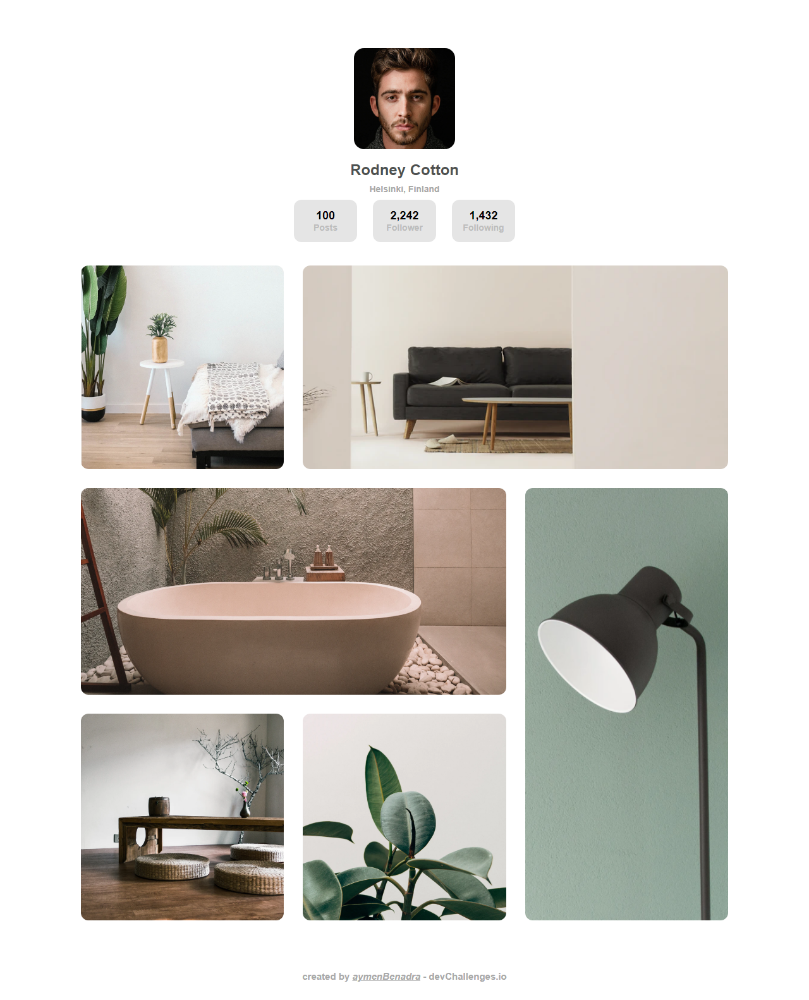

<h1 align="center">My Gallery Page</h1>

   Solution for a challenge from  <a href="http://devchallenges.io" target="_blank">Devchallenges.io</a>.

  <h3>
    <a href="https://benadra.me/My-Gallery-Page/">
      Demo
    </a>
     | 
    <a href="https://github.com/aymenBenadra/My-Gallery-Page">
      Solution
    </a>
     | 
    <a href="https://devchallenges.io/challenges/gcbWLxG6wdennelX7b8I">
      Challenge
    </a>
  </h3>

<!-- TABLE OF CONTENTS -->

## Table of Contents

- [Table of Contents](#table-of-contents)
- [Overview](#overview)
  - [Built With](#built-with)
- [Features](#features)
- [Contact](#contact)

<!-- OVERVIEW -->

## Overview

This was a tricky project as I didn't create a card myself before using pure html and Scss, I usually used Bootstrap or other libraries for that but I made it to the end using only Html and SCSS to further learn about the fondamentals behind the scenes.

I used Flexbox for positioning the elements on the Header (which is the Card) and CSS Grid to structure the Gallery.

### Built With

<!-- This section should list any major frameworks that you built your project using. Here are a few examples.-->

- Html and SCSS  
*I used Sass and Html to improve my skils with them both*

## Features

<!-- List the features of your application or follow the template. Don't share the figma file here :) -->

This application/site was created as a submission to a [DevChallenges](https://devchallenges.io/challenges) challenge. The [challenge](https://devchallenges.io/challenges/gcbWLxG6wdennelX7b8I) was to build an application to complete the given user stories.

## Contact

- Website [benadra.me](https://benadra.me)
- GitHub [@aymenBenadra](https://github.com/aymenBenadra)
- Twitter [@aymen_benadra](https://twitter.com/aymen_benadra)
